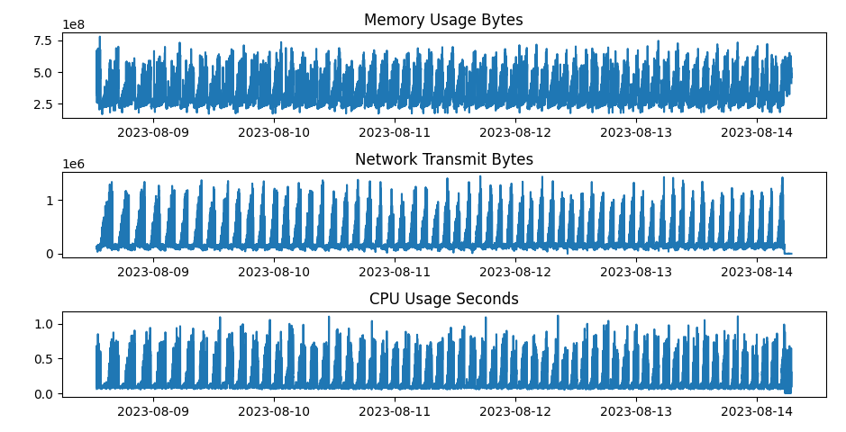
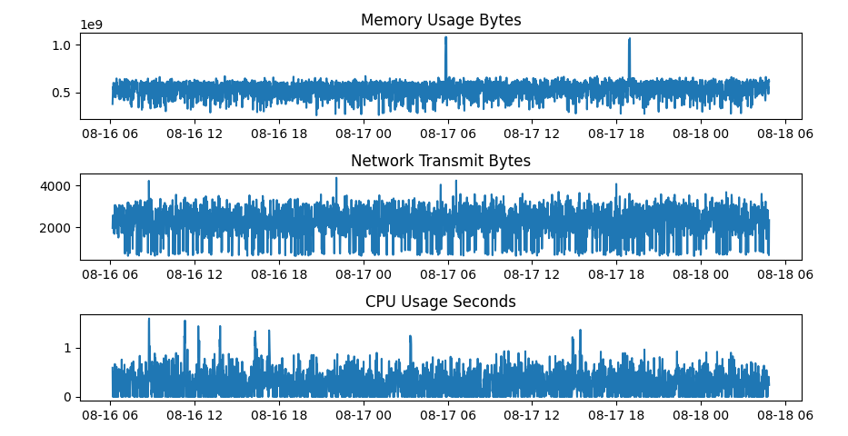

### Sock-Shop-Dataset

We deployed [Sock Shop](https://microservices-demo.github.io/) in a Kubernetes cluster containing three machines. Seven days of data were collected, of which the first four days were normal data used for training, while the next two days collected test data containing container chaos, and the last day was test data containing node chaos.

**Notes**: 

1. We provide information about container and node chaos in `container_chaos_info.csv` and `node_chaos_info.csv`, respectively, including the type of fault injected, the time and target. 
2. `vm1`, `vm2` and `vm3` refer to `192.168.31.237`, `192.168. 31.172` and `192.168.31.103`, respectively.

---

### Data Examples

training data:

test data:

